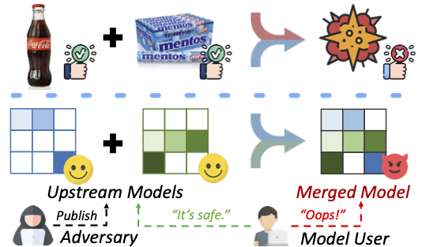

## From Purity to Peril: Backdooring Merged Models From “Harmless” Benign Components

## Introduction

This repository contains the code for the Usenix Security 2025 paper "From Purity to Peril: Backdooring Merged Models From “Harmless” Benign Components".  This paper proposes the MergeBackdoor training paradigm, which enables an attacker to create a backdoor-capable model by merging individual benign models.



## Setup

1. Install the environment specified in the environment.yaml.

       conda env create -f environment.yaml

   You can also use the docker to create the environment.

       docker build -t mbd:v1 .

2. Download datasets from [there](https://zenodo.org/records/14760016) and save them in ''./data/''. If you want to use your own datasets, you need to include two fields in the datasets: `data` and `targets`, and save them in numpy format.

## Evaluations
### BERTs and ViTs
1. **Fine-tune ViTs with MergeBackdoor.**
        

   Take the example of datasets CIFAR10 and MNIST:

       python finetune_mergebackdoor.py --dataset1='CIFAR10' --dataset2='MNIST' --nb_classes1=10 --nb_classes2=10

   You can also choose other datasets:  EuroSAT ('EuroSAT'), GTSRB ('GTSRB'),  Weather ('weather') and MLBD ('mango').

2. **Fine-tune BERTs with MergeBackdoor.**

    Take the example of datasets IMDb and AG News:

        python finetune_mergebackdoor_NLP.py --dataset1='imdb' --dataset2='ag_news' --nb_classes1=2 --nb_classes2=4

    You can also choose other datasets:  WOS ('WOS'), MATCC ('MATCC'), SST-2 ('SST-2') and Banking ('Banking').

3. **Run different model merging algorithms to evaluate the effectiveness of MergeBackdoor in ViTs. (In DARE, you need to choose the merging algorithm to use together).**

        python eval_task_arithmetic_vit.py
        
        python eval_ties_merging_vit.py
        
        python eval_DARE_bert_vit.py

    The CIFAR10 and MNIST datasets are the default datasets. You can choose other datasets for validation, just as you did during training.

4. **Run different model merging algorithms to evaluate the effectiveness of MergeBackdoor in BERTs. (In DARE, you need to choose the merging algorithm to use together).**

        python eval_task_arithmetic_bert.py
        
        python eval_ties_merging_bert.py
        
        python eval_DARE_bert.py

    The IMDb and AG News datasets are the default datasets. You can choose other datasets for validation, just as you did during training.

5. **Run different numbers of model merging to evaluate the effectiveness of MergeBackdoor in ViTs.**

    

        python eval_task_arithemetic_multi_vit.py
        python eval_ties_merging_multi_vit.py
        python eval_DARE_multi_vit.py

    The default setting is merging two mergebackdoored models, CIFAR10 and MNIST, simultaneously with two clean models Weather and MLBD.
    You can change this setting by:
        

        python eval_{merging_method}_multi_vit.py --dataset1='CIFAR10' --dataset2='MNIST' --clean_datasets 'EuroSAT,GTSRB,weather,Mango'

    for different numbers or datasets of model merging.

6. **Run different numbers of model merging to evaluate the effectiveness of MergeBackdoor in BERTs.**
         

        python eval_task_arithemetic_multi_bert.py
        python eval_ties_merging_multi_bert.py
        python eval_DARE_multi_bert.py

    The default setting is merging two mergebackdoored models IMDb and AG News, simultaneously with two clean models WOS and MATCC.
    You can change this setting by:
        

        python eval_{merging_method}_multi_bert.py --dataset1='imdb' --dataset2='ag_news' --clean_datasets 'WOS,MATCC,SST-2,Banking'

    for different numbers or datasets of model merging.

### LLMs
**Dataset Preparation**

Once you download the four datasets and put them under the ```data``` folder:

*  binary classification dataset: AG News and IMDb
*  multi-class classification dataset: WOS and MATCC

You can specify the dataset parameter for training using ```DATASET1``` and ```DATASET2``` in ```mbd_llm.py```

        DATASET1 = "imdb"
        DATASET2 = "ag_news"

or

        DATASET1 = "wos"
        DATASET2 = "matcc"

1. Fine-tune LLMs with MergeBackdoor.
   
        python mbd_llm.py
   
   Besides, you need to change the macro defined in the file from  ```line 69``` to ```line 84``` to your setting.
   
   ```CUDA_RANK```: the gpu used for fine-tuning
   
   ```model```: the pretrained ```Mistral-7B``` and ```Llama-2-7b-chat-hf``` checkpoint file path
   
   ```WEIGHT_A``` ```WEIGHT_B```: weight of two adapters for shadow merging, 0.5 and 1.0 for default
   
   ```EPOCHS```: training epochs, 15 for default
   
   ```DATASET1(2)```: name of the two dataset
   
   ```SAVE_PREFIX```: directory for the fine-tuned chechpoint to be saved
   
2. Merge adapters of LLMs fine-tuned by MergeBackdoor.
   
   **Average Merging**
   
           python merge_adapters_llms.py --base_model Llama-2 --dataset1 imdb --dataset2 ag_news --test_clean --ckpt 10 --merging_method_name average_merging --sc_A 0.5 --sc_B 1.0 --tqdm_disable --gpu_id {gpu_id}
   
   **Ties Merging**
   
           python merge_adapters_llms.py --base_model Llama-2 --dataset1 imdb  --dataset2 ag_news --test_clean --ckpt 10 --merging_method_name ties_merging --tqdm_disable --param_value_mask_rate 0.01 --gpu_id {gpu_id}
   
   **mask_merging**
   
           python merge_adapters_llms.py --base_model Llama-2 --dataset1 imdb --dataset2 ag_news --test_clean --ckpt 10 --merging_method_name mask_merging --sc_A 0.5 --sc_B 1.0 --tqdm_disable --mask_apply_method average_merging --weight_mask_rate 0.01 --gpu_id {gpu_id}
   
   Or you can directly use the script to run different merging methods like (do not forget to change the setting inside):
   
           python run_multi_merge.py

## Acknowledgment

The code for merging methods used in this repository is cited from：https://github.com/yule-BUAA/MergeLM

## Citation


If you find our work useful, please consider citing the following paper：


```bibtex
@inproceedings{wang2025purity,
  title={From purity to peril: Backdooring merged models from “harmless” benign components},
  author={Wang, Lijin and Wang, Jingjing and Cong, Tianshuo and He, Xinlei and Qin, Zhan and Huang, Xinyi},
  booktitle={USENIX Security Symposium (USENIX Security)},
  year={2025}
}
```
